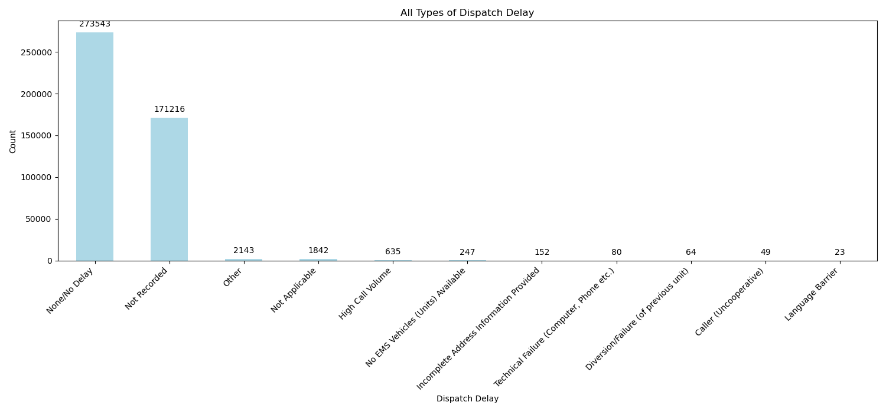
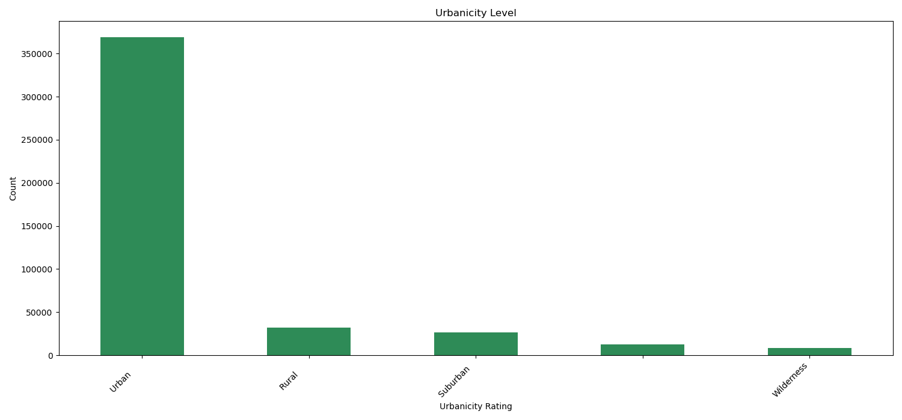

# Exploratory Data Analysis: Team 3

## Data Summary

Files contained within the cardiac arrest zip file

Some aspects to note:
* There are 32 total files
* These files contain 1.41 GB of collective data
* The largest file is 352 MB
* The smallest is 9.5 MB

## Data Description

The data is organized as event-based data, where each event is a 911 call. Of the 44 million 911 calls included in the full dataset, 448,684 involve cardiac arrests - these data points are the focus of this analysis. The full dataset includes a variety of variables related to the patient, EMS response, medical intervention, and ultimately health outcome. 

Below is a basic overview of the dataset used for this analysis.
  

## Data Dictionary

Given that we are only using a subset of the original data, and the fact that this data has been modified, we elected to compile our own dictionary of variables in the dataset - below is a link to this list. For each variable, this table includes the variable name, variable definition, file where the data is stored, the variable grouping, and a link to the documentation for how responses are coded (when applicable).

[Data Dictionary](./Data_Dictionary.csv)

A live version of this document is also available at the following link:
https://docs.google.com/spreadsheets/d/1AsTnBd0W5agKb1ZK4GeVyUNL5vcFD_KBbN0g2pAqs4Q/edit#gid=0

The data can be grouped into the following categories of data:
* Patient Demographics: variables about the race, history, and origin of the patient
* Sources of Delays: variables recording different types of delays (transport, scenic, response, etc.) experienced in getting the patient to the hospital 
* Observed Risk Factors / Symptoms: variables listing the risk factors and symptoms observed by EMS
* Vitals: variables reporting the patient's major health statistics
* Administered Treatments: variables tracking the protocols activated on, medications given to and procedures performed on the patient
* EMS Response: variables related to the EMS response, such as whether EMD was performed or whether there was any injury to the EMS personnel
* Cardiac Arrests: variables related to whether there was a cardiac arrest and, if so, the potential causes
* Location: variables locating the event by US Census region and division, and a rating of urbanicity 

## Visualizations of Selected Variables

To help us understand the dataset, we created basic visualizations of the distributions of some of the variables. Note that in almost every plot, "Not Applicable" or "Not Recorded" are either the most frequent response or the second most frequent response - indicating that missing values is a key obstacle we will need to overcome.

### Plots of select variables related to EMS response delays:

#### Important Note:  
We have a section below discussing [Data Shortcomings](#data-shortcomings), however, we wanted to demonstrate 
graphically the significance of missing data.  For that we will just use one of the plots.  We are interested in delays 
to service for cardiac arrest patients.  Below is a plot of all different types of dispatch delays.  Of note are the 
171,216 missing pieces of data as well as 2,143 other and 1,842 not applicable.  That is a huge amount of missing or 
undetermined data points.  Removing all of those rows makes a huge statistical difference.  

The second plot is what it looks like when we remove those rows as well as the rows where no delay occurred.  It is 
clear why imputation for missing data is a big deal.  We don't know in what way inferring those missing pieces would 
modify the second plot!

  

  

  

  

  

  

### Plots of select variables related to patient demographics:

Patient gender:

  

Patient race:

  

## Plot of Urbanicity

Note: some observations have blank values for this variables - this is critical to note, since this will be the primary way that rurality is proxied

  

### Plots of select variables related to the EMS response:

Risk factors identified by EMS responders:

  

  

EMS personnel injuries:

  

EMS rating of patient acuity:

  

  

### Plots of select variables related to the patient's vital signs:

For these plots, we dropped N/A values. Note that both plots show many observations around 0, which makes sense for patients experiencing cardiac arrests.

  

  

### Plots of select variables related to the patient's cardiac arrest:

  

  

  

### Plot of select variables related to attempted patient's revival from cardiac arrest:

  

### Plot of select variables related to patient's alcohol usage:

  

 

## Data Shortcomings

Likely the largest difficulty with this dataset is the quantity of missing values present in it - as indicated by the plots above, the most frequent response for most variables is either "Not Applicable" or "Not Recorded", which are essentially variants of N/A. In order to get around this without trimming the size of the data set too much, we will need to employ computational methods to estimate missing values. While the MICE and missforest algorithms are suggested methods for data imputation in the project description, we will need to discuss with the stakeholder their specific goals with this data to understand the best way to account for missing values.

## Questions for Stakeholder

When we meet with the stakeholders, the below questions are most relevant to get answered:
* What is your primary goal with this analysis / what underlying questions are you trying to answer?
* What work have you already done on this research question? What techniques have already been tried?
* What outcome variables are most meaningful to those questions?
* What vital signs / medical metrics are most closely linked to cardiac arrests (assuming this is an area of focus)?
* How was the computed variable related to urbanicity created? How about the computed time variables?
* What independent variables are you most curious to understand the impact of?
* Do you have a data dictionary that reflects any changes you have done to the original data set?
* What would be most helpful for us to do vis-à-vis data cleaning / missing value imputation?
* What are the current limits of your analysis?
* Given the existing research done, what variable relationships are most meaningful?
* Are there specific data visualizations that would be helpful for you to see?

## Next Steps

After completing the initial exploration of the data, the next steps for completing this project are as follows:

* Attempt methods of cleaning the data of missing values without trimming the data too much
* Meet with the stakeholder when they return from vacation to identify focus areas for analysis
* Visualize relationships between variables to determine which are meaningful
* Decide on the approach of our analysis: what outcome variables do we care about, what independent variables do we care about, what modelling approach will we use, how will we present our findings, etc
* Write up the proposal and plan for this project 

