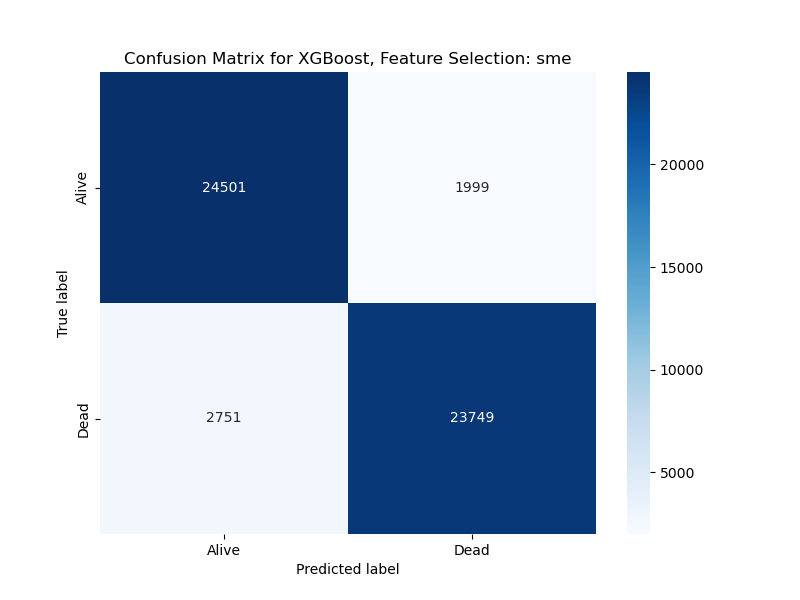
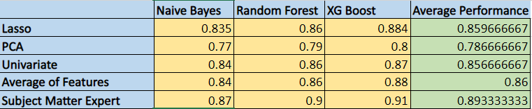

# DS5110 Final Project: EMS Cardiac Arrest Predictors

## Project partners

* Lillith Chute - Team Lead
* Cristal Wilson Lobo
* Jonas Eichenlaub

## Stakeholders

* Dr. Qingchu Jin (primary POC) at The Roux Institute
* Dr. Christine Lary at The Roux Institute
* Dr. Teresa May at MaineHealth

## Story

MaineHealth is a not-for-profit integrated health system and is the largest medical group in Northern New England. 
It is listed as one of the nation’s top 100 healthcare delivery networks.  Their critical care doctors are keen on 
using data from cardiac arrest patients to improve the odds of their survival.  A key source of this data for this 
project is the use of NEMSIS (National Emergency Medical System (EMS) Information System).  This data repository 
captures every 911 call across the nation.  Of particular interest are those calls concerning cardiac arrest patients, 
with a distinct angle on understanding the role of 'rurality'.  Of note is the fact that this phase of the project 
does build on previous work.  Additional possibilities of exploration include exploratory data analysis and examining 
the implications of imputed data.  This will pave the way for a long term vision of an application used for exploring 
or visualizing the data.

## Data

* The primary source of data will be from our stakeholder, Dr. Jin at The Roux Institute.  This data is a subset of the 
 originally available data.
* The original data source is located at www.nemsis.org

  
### Data Setup
Once you have obtained the data from the stakeholders and cloned the repository, run the following command:
```
make data_dir
```
then put the zip file: preprocesseddataCA.zip in the data folder.

### Exploratory Data Analysis

To run the plot for the exploratory data analysis, please run the following command: 
```
make eda_plots
```
Please see the following document for a detailed discussion of our initial analysis:  
[Exploratory Data Analysis Document](./EDA.md)

## Project Overview

### Data Pipeline Summary

Below is a brief explaination of the steps taken to complete this analysis:
- Combined the data files into one dataframe from all of the files
- Cleaned the data, including dropping certain columns (like date/time columns and medication columns) and imputing missing values using a 'most frequent value' approach
- Encoded a binary outcome variable (which corresponds to Dead or Alive) based on the eArrest18 variable (which tracks the outcome of cardiac arrests)
- Dropped rows with missing Outcome values
- Created three feature selection scripts to help us understand which features are worth including in our models:
    - Univariate feature selection: Uses a univariate feature selection approach to rank variables using both the F statistic and Mutual Information metrics for scoring. This script records the top 30 features selected by both scoring approaches, averages the two rankings, and then reports the 20 features with the highest average ranking.
    - PCA feature selection: Runs PCA with varying number of components (from 1 to 200) and then uses a Logistic regression to assess the performance of a model based   on the principal components. This script then reports the features that contribute strongest to each principal component in the best model (of the models with 30 or fewer components).
    - Lasso feature selection: Runs logistic regression with an l1 penalty to mimic the lasso model for a classification context. This script varies the weight placed on the penalty term and then reports the best model that includes 30 or fewer features.
- Created a script run each of the above feature selection algorithms and then output the best 20-30 features selected by each one (exact number of reported features varies based on the method).
  - Output text files are saved in the `output` folder.
  - The scripts also include the ability to select which feature selection algorithm(s) to run. The script is also parameterized to be able to be run on balanced or unbalanced data.
- Leveraged annotations made by Dr Theresa May on which features are worth including as well as commentary by Brandon Skwarto (3rd year mdeical student) to create a list of 20 features. This list of subject matter expert selected features is used as a baseline to compare against the features selected by each of the algorithms.
- Created scripts to run three models: Naive Bayes, XGBoost, and Random Forrest. 
  - These scripts run the models with 5-fold cross validation and use BayesSearchCV to tune hyperparameters. 
  - The scripts also include a number of parameters that can be changed to adjust the model run, including the ability to select which features to use (either the features selected by the feature selection scripts or a set of features selected by a subject-matter expert). 
  - The scripts also include the ability to balance the data (by selecting an equal number of Dead and Alive observations) or to use the full dataset (which is unbalanced). 
  - The scripts also include the ability to select which model(s) to run. The scripts then output the results of the model run, including the best hyperparameters and the confusion matrix for the best model. 
  - The scripts also save the confusion matrix plot to the `figs` folder.

### Assumptions

These are our assumptions for the project:
1. In relation to any of our models output, we will be predicting alive or dead.
   1. These outcomes will have to be feature engineered from the eArrest.18 variable in Pub_PCRevents_CA.  eArrest.18 has 6 categories of 
   documening the outcome of a cardiac arrest incident. We will be making judgements on whether we think the end result is alive, dead, or unknown.
   2. While the stakeholder originally specified an outcome variables with possible values of alive, dead, or coma, we did not see a straightforward
    way to encode coma outcomes and so opted to simplify this problem to be a binary one.
2. We are imputing missing data (indicated by NA, not applicable, not recorded, etc codes) with median values for numeric variables and the most frequent
    value for categorical variables. While this obviously is not the best approach, it is better than dropping most of the data.
3. We are dropping rows with missing data in the outcome column
4. Variables that encode information which is obtained after the patient lives/dies from the cardiac arrest (such as a variable indicating that the patient
    is being taken to a morgue) should be excluded from the possible features to consider since these variables have no predictive value. Our understanding 
    of the stakeholder's goals is that selected features should be able to predict the outcome based off information available at the time the patient arrives
    at the hospital.
5. We are excluding categorical features that have over 100 options in order to limit the number of different indictaor variables are created when we encode the
    categorical variables. Unfortunately, this does have the potential to exclude features that have high predictive value, such as variables encoding the
    medications pr procedures administered to the patient.
6. We try to keep the total number of features included in the models to around 20. We recognize that the optimal model may include many more features than this,
  but for the sake of keeping the number of selected features small enough for us to analyze and interpret, we limited the feature selection algorithms to exclude 
  any parameter combinations that selected more than 30 features.

### Areas For Future Research

- Potentially explore how different imputation techniques change our results (if we have time)
- Experiment with different metrics for model evaluation like ROC-AUC.
- Explore other error analysis techniques that might prove beneficial.
- Explore additional research on what other data scientist have found important in their work with the NEMSIS data.
- Perform this analysis using a more sophisticated target variable that is engineered off multiple variables from the dataset and/or includes a Coma outcome.
- Included the difficult to encode variables related to medications and procedures administered, which we have excluded from our analysis.


## Project Execution

### Data Extraction and Setup

The script processes and prepares emergency medical services data from source folder processedDataCA. It begins by identifying two main types of files: a comprehensive file containing a wide array of data and individual files that detail specific data columns. Both types share a common identifier for merging, known as PCRKey.

```
make combine_data
```

 The initial step involves reading and merging the two primary data files based on the PCRKey. Additional CSV files from the same folder, which exclude the two primary files, are then incorporated into the main dataset using the same identifier. 
 Subsequently, the script loads a set of code definitions from XML Schema Definition files, which are used to translate numerical codes in the data into their descriptive text equivalents. This translation makes the dataset more accessible and easier to understand. 
 As the data is consolidated, certain columns are identified that do not match the entries in the provided data dictionary like (eArrest_05, eDisposition_12, eResponse15) and so on. 
 Finally, the script outputs the fully merged and updated dataset to a CSV file, creating a single, comprehensive dataset that includes descriptive text for codes and is ready for feature selection and model training process. 

### Data Cleaning

After creating the combined data file, execute the below command to clean the data, which includes imputating missing values with the most frequent value, dropping problematic columns (date/time columns and categorical columns with over 100 possible values), and encoding the binary outcome variables. This saves the cleaned data
into the `data` folder.

```
make clean_data
```

### Feature Selection

#### Algorithm Advantages:
- Univariate: 
  - Simple and fast.   
  - Does not depend on any underlying model
  - Easy to interpret results
- Principal Component Analysis: 
  - Selects features orthagonal to each other, so avoids selecting correlated features
  - Selects features with the most impact from each dimension of the data
- Lasso: 
  - Model designed to select best features
  - Results are easy to interpret
  - Can be tuned to control how much weight is placed on the penalty term, which determines how many features are selected

#### Running the Algorithms

To run the feature selection algorithms against (half) of the cleaned data, use the following `make` command with nonoptional parameters:

```
make select_features balance=<balance> feature_selection="<selection_methods>"
```

To run all feature selection algorithms on the balanced data, use the below command:

```
make select_features balance=True feature_selection="pca uni lasso"
```

This script creates plots of model performance in the figs folder and text files saving the full results in the output folder. It also prints out the best set of features selected by each method. This script also saves two new data files, one used in this script for feature selection, the other reserved for running the models. 

#### Parameters:
- **balance** (required): A boolean flag (True/False). If True, the data will be balanced by using an equal number of 'Alive' and 'Dead' outcomes. If False, all instances of both outcomes are used, even if unbalanced. Note: this parameter is case sensitive and only accepts True/False, not true/false
- **feature_selection** (required): A space-separated list of algorithms types to run. Options include:
   - `'pca'`: PCA algorithm.
   - `'uni'`: Univariate algorithm.
   - `'lasso'`: Lasso algorithm.


### Model Building

#### Model Advantages:
- Naïve Bayes: 
  - Simple and fast.   
  - Very good when using a large dataset 
  - Makes a good baseline model.  If it performs well, might not need a more complex model. 
- Random Forest: 
  - As an ensemble method it’s generally robust against overfitting 
  - Effective at handling both categorical and continuous input 
  - Captures non-linear relationships 
- XGBoost: 
  - Known for delivering high-performance models. 
  - Handles various data types 
  - Includes regularization 
  - Computationally efficient and handles large datasets.

#### Running the Models
To run the models against the cleaned data, use the following `make` command with optional parameters except for the 
filename:
```
make models filename=<filename> balance=<balance> feature_selection=<selection_method> model_types="<model_types>"
```

If only the filename is specified the other parameters defaults to:

```
make models filename=cleaned_Data.csv balance=true feature_selection=sme model_types="NB"
```

#### Parameters:

- **filename** (optional): The name of the CSV file to be used. If absent, `cleaned_Data.csv` in the data directory is used by default.
- **balance** (optional): A boolean flag (true/false). If true, the data will be balanced by using an equal number of 'Alive' and 'Dead' outcomes. If false, all instances of both outcomes are used, even if unbalanced.
- **feature_selection** (optional, select one): The method for feature selection. Options include:
   - `'sme'`: Subject-matter expert features.
   - `'avg'`: Averages scores from different feature selection algorithms and selects top features.
   - `'pca'`: Features selected by PCA algorithm.
   - `'uni'`: Features selected by univariate algorithm.
   - `'lasso'`: Features selected by Lasso algorithm.
- **model_types** (optional): A space-separated list of model types to run. Options include:
   - `'NB'`: Naive Bayes.
   - `'XG'`: XGBoost.
   - `'RF'`: Random Forest.

#### Model Execution Process

1. Data is loaded from the specified CSV file. If no file is specified, `cleaned_Data.csv` is used.
2. If `balance` is true, data is balanced based on 'Alive' and 'Dead' outcomes.
3. Feature selection is performed based on the specified method.
4. The script label-encodes categorical features and scales the data.
5. Specified model(s) are run with the following considerations:
   - Models utilize 5-fold cross validation.
   - BayesSearchCV is used for tuning hyperparameters.

#### Model Note
- Ensure that `cleaned_data.csv` is present in the data folder as it is required for model execution if you have no 
 other file specified.  This will be generated by the prior `make` commands.
- For this project, only 'Alive' and 'Dead' outcomes are considered. 'Unknown' outcomes are removed from the dataset.

At this stage, there are a number of manual process that need to be done to run the models or exist as 
hardcoded values within the model code itself.  These are listed below:

1. Within the cleaned_Data.csv there are three outcomes: **'Alive'**, **'Dead'**, and **'Unknown'**.  For purposes of 
 this project we are interested in the **'Alive'** and **'Dead'** outcomes.  The **'Unknown'** outcome is removed from the data set.
2. Sorting by the outcome if you are using the default `cleaned_data.csv`, there are  53,960 **'Alive'** outcomes and 
 263,587 **'Dead'** outcomes.  Use the `balance` parameter to balance the data set if you don't want it imbalanced.  
3. You can select only one type of method for feature selection.  The options are noted above.
4. The model script will appropriately label encode the categorical features and scale the data.  

## Results

We ran the models through all the different feature selection methods.  We compared the best feature selection 
method and model versus how they would do using only features selected by a subject-matter expert paired with the best 
performing model. See [Results](./docs/README.md) for a detailed summary of the results, including the lists of features selected.

#### A note on data and cross-validation:
To avoid "cheating" using cross validation, we made certain to divide the data into a set used for the feature selection 
algorithms and a separate set used for the models.  

Below is an **_excerpt_** of the results of running these models on the balanced dataset.  

#### Subject-Matter Expert results:
```
Model: XGBoost
  Accuracy: Mean=0.910, Std=0.000740
  F1_score: Mean=0.910, Std=0.000738
Best hyperparameters: OrderedDict([('learning_rate', 0.1), ('max_depth', 7), ('n_estimators', 200)])
```


#### Lasso results:
```
Model: XGBoost
  Accuracy: Mean=0.884, Std=0.003328
  F1_score: Mean=0.884, Std=0.003373
Best hyperparameters: OrderedDict([('learning_rate', 0.1), ('max_depth', 7), ('n_estimators', 300)])
```


The subject-matter expert results are better than any of the algorithm based results, of which the Lasso is the best. The selected 
22 features whereas the lasso  algorithm used 26.  Additionally, we elected to perfectly balance the data set in order to ensure that the 
model was not biased towards one outcome. Per feedback from the stakeholder, we expanded our analysis to have the option of using unbalanced 
data.


Finally, here is an ablation table covering the overall results across feature selection methods and models using the balanced data:

