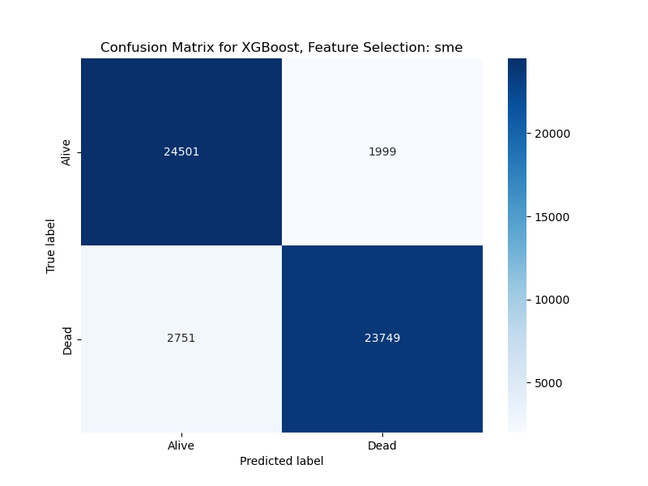
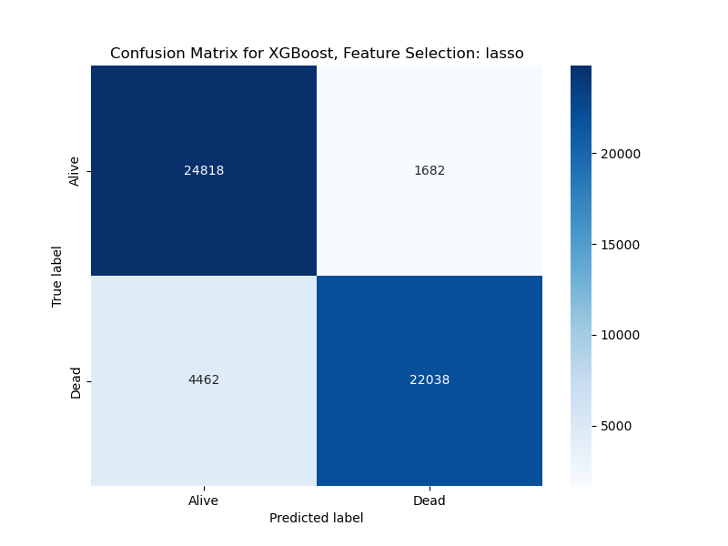

# DS5110 Final Project: EMS Cardiac Arrest Predictors

## Project Results

We ran the three models on each of the five sets of features using data balanced by the Outcome variable (Dead/Alive) and on both the original, unbalanced data. This document summarizes some of the more notable results from this analysis. See the Model Results excel file for the full results these model runs. This excel file can also be viewed online at the below link if you are logged in to a Northeastern Microsoft account.

[Model Results](./Model_Results.xlxs)

Link: https://northeastern-my.sharepoint.com/:x:/g/personal/eichenlaub_j_northeastern_edu/EdicoZ63QG1Pv1QVKjJHcnQBYYBfY-ksHqZSZsERouM2uA?e=8sTZhp

#### A note on data and cross-validation:
To avoid "cheating" using cross validation, we made certain to divide the data into a set used for the feature selection 
algorithms and a separate set used for the models. 

## Results using Balanced Data

Below are the results of our feature selection algorithms and models using data balanced on the outcome variable. To get these results, we broke the data into 53000 rows with an "Alive" outcome and 53000 rows with a "Dead" outcome. We then used half of this dataset for the feature selection scripts and half for the models.

### Features Selected
Below is a table listing the features selected by each of the feature selection approaches we employed. This includes the following:
- Lasso: Logistic regression that includes an l1 weight places on including features in the model. We excluded possible models that used more than 30 features. 
- PCA: Principal Component Analysis that extracts the most important feature from the top 20 components.
- Univiariate: Performed Univariate Feature Selection using two scoring metrics: mutual information and the F statistic, then took the average feature rankings between the two and selected the top 20 features.
- Average: Average the feature rankings from the each of the above three algorithmns, then selected the top 20.
- Subject Matter Expert (SME): Features selected based off Theresa May's annotations of the feature list, comnined with input from Brandon Skwarto (medicial student).
  List of potential features was judgmentally slimmed down to 20 features based off domain knowledge.

  

We then performed a comparative analysis of these features to determine which feature selection techniques selected similar features. We broke the features down into general groupings:
- Green highlighted features: features selected by the SME that were also selected by most of our algorithms. These features indicate agreement between SME and algorithmic
  feature selection techniques.
- Yellow highlighted features: features selected by all of our algorithms that are excluded from the SME. These features may be less intuitive to include, but clearly have
  explainitory power and are worth considering adding to a model.
Blue highlighted features: features included by the SME but not included by any of our algorithms. These features are worth analyzing further - they may be less predictive
  than expected, or may be the reason the SME feature list performs the best on our models.
Purple highlighted feature: this is the Urbanicity feature that the stakeholder has special interest in. Interestingly, it is excluded by all but the SME list. It is worth
  considering if this is heavily correlated with the already included geographic or transport time features which may explain its exclusion from the algorithm feature lists.
White highlighted features: features only included in one or two of our methods and not the SME list.


  


### Model Results
This is the ablation table covering the overall results across feature selection methods and models using the balanced data:


The best performing features are those selected by the subject-matter expert and stakeholder.

#### Subject-Matter Expert results:
```
Model: XGBoost
  Accuracy: Mean=0.910, Std=0.000740
  F1_score: Mean=0.910, Std=0.000738
Best hyperparameters: OrderedDict([('learning_rate', 0.1), ('max_depth', 7), ('n_estimators', 200)])
```


The best performing pure algorithm is Lasso.

#### Lasso results:
```
Model: XGBoost
  Accuracy: Mean=0.884, Std=0.003328
  F1_score: Mean=0.884, Std=0.003373
Best hyperparameters: OrderedDict([('learning_rate', 0.1), ('max_depth', 7), ('n_estimators', 300)])
```



## Results using Unbalanced Data

Below are the results of our feature selection algorithms and models using data the entire original dataset. This data has 263586 rows with a Dead outcome and 131135 rows with an Alive outcome. We then used half of this dataset for the feature selection scripts and half for the models.

### Features Selected
Below is a table listing the features selected by each of the feature selection approaches we employed. The only list that is identical in both the balanced and unbalanced scenarios is the subject matter exper feature list, which we left unchanged.

  


### Model Results
This is the ablation table covering the overall results across feature selection methods and models using the balanced data:


The best performing features are those selected by the subject-matter expert and stakeholder. Interestingly, the models performed similarly when run on the balanced and unbalanced datasets. Lasso remains the best algorithm, but the PCA algoirthm notably imrpoved with the unbalanced data as compared to the balanced data scenario.

#### Subject-Matter Expert results:
```
Model: XGBoost
  Accuracy: Mean=0.911, Std=0.002083
  F1_score: Mean=0.911, Std=0.002087
Best hyperparameters: OrderedDict([('learning_rate', 0.1), ('max_depth', 7), ('n_estimators', 200)])
```


The best performing pure algorithm is Lasso.

#### Lasso results:
```
Model: XGBoost
  Accuracy: Mean=0.880, Std=0.003564
  F1_score: Mean=0.880, Std=0.003587
Best hyperparameters: OrderedDict([('learning_rate', 0.1), ('max_depth', 7), ('n_estimators', 300)])
```


## A Question We Got:

#### How is it that your SME could choose a more predictive set of features than your algorithms?

#### Answer:
We have a few hypothesis as to why this might be so:
 
1. SMEs have more domain knowledge and intuition with regard to their data.  They may have a better intuitive sense of 
 factors that relate to each other.  A sense that goes beyond the data, if you will.
2. Algorithms tend to look at features individually, but a SME can identify synergistic effects where the combination 
 of two features together is more predictive than either one alone.
3. The fact that we didn't "cheat" (use the same set of data for feature selection and model training) also helps 
 explain why your SME's selections could beat the algorithms.

The real advantage SMEs have is the ability to utilize deeper understanding of context, semantics, causality.  I think 
the combination of their insight AND features the algorithms selected would ultimately be the best set of features.


## Next Steps:
- Potentially explore how different imputation techniques change our results (if we have time)
- Experiment with different metrics for model evaluation like ROC-AUC.
- Explore other error analysis techniques that might prove beneficial.
- Explore additional research on what other data scientist have found important in their work with the NEMSIS data.  
- Perform this analysis using a more sophisticated target variable that is engineered off multiple variables from the dataset and/or includes a Coma outcome.
- Included the difficult to encode variables related to medications and procedures administered, which we have excluded from our analysis.
- Explore combining the features selected by the algorithms with those chosen by the subject matter expert
